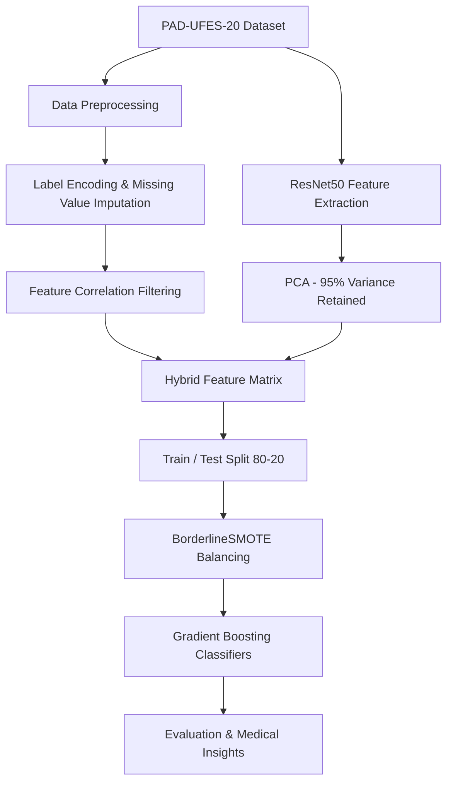

# Hybrid Approach for Skin Cancer & Skin Lesion Classification

[](https://www.python.org/)
[](https://www.tensorflow.org/)
[](https://scikit-learn.org/)
[](https://xgboost.readthedocs.io/)
[](LICENSE)
[](https://www.kaggle.com/datasets/mahdavi1202/skin-cancer)

> **A hybrid machine learning pipeline that combines clinical metadata and deep learning image features (ResNet50 + PCA) to classify six skin lesion types — achieving up to 75% accuracy and 92.5% ROC AUC on the PAD-UFES-20 dataset.**

---

## Table of Contents

- [Overview](#overview)
- [Key Features](#key-features)
- [Skin Lesion Classes](#skin-lesion-classes)
- [Methodology](#methodology)
- [Model Performance](#model-performance)
- [Dataset](#dataset)
- [Project Structure](#project-structure)
- [Installation](#installation)
- [Usage](#usage)
- [Medical Insights](#medical-insights)
- [Technologies Used](#technologies-used)
- [Citation](#citation)
- [Author](#author)
- [Keywords](#keywords)

---

## Overview

This repository implements a **hybrid approach for skin cancer and skin lesion classification** that fuses two complementary data modalities:

1. **Tabular clinical metadata** — patient demographics, lesion symptoms, biopsy status, and history
2. **Visual deep learning features** — 2048-dimensional embeddings extracted from dermoscopic images using a pre-trained **ResNet50** CNN, reduced to 324 components via **PCA**

The combined feature set is fed into ensemble **gradient boosting classifiers** (XGBoost, LightGBM, CatBoost, and more), with **BorderlineSMOTE** applied to handle class imbalance.

This project was developed as a **Kaggle notebook** using GPU acceleration and is ideal for researchers and practitioners working on:

- Skin cancer detection with machine learning
- Hybrid multimodal medical AI pipelines
- Dermatology image classification
- Clinical decision support systems

---

## Key Features

| Feature | Description |
|---|---|
| **Hybrid multimodal fusion** | Merges tabular EHR-style features with CNN image embeddings |
| **Transfer learning** | ResNet50 (ImageNet weights) for robust dermoscopic feature extraction |
| **Dimensionality reduction** | PCA retains 95% variance (2048 → 324 features) |
| **Smart imputation** | Random Forest regression/classification for missing value handling |
| **Feature selection** | Correlation-based filtering removes low-signal clinical features |
| **Class balancing** | BorderlineSMOTE oversampling for imbalanced lesion classes |
| **Model comparison** | Side-by-side evaluation of 6 boosting algorithms |
| **Medical analytics** | Demographic and epidemiological insight visualizations |

---

## Skin Lesion Classes

The model classifies **6 diagnostic categories** from the [PAD-UFES-20](https://data.mendeley.com/datasets/zr7vgbcyr2/1) dataset:

| Code | Label | Full Name | Type |
|:---:|---|---|---|
| `BCC` | Basal Cell Carcinoma | Basal Cell Carcinoma of Skin | Malignant (biopsy-proven) |
| `SCC` | Squamous Cell Carcinoma | Squamous Cell Carcinoma | Malignant (biopsy-proven) |
| `MEL` | Melanoma | Melanoma | Malignant (biopsy-proven) |
| `ACK` | Actinic Keratosis | Actinic Keratosis | Pre-malignant / Benign |
| `NEV` | Nevus | Melanocytic Nevus | Benign |
| `SEK` | Seborrheic Keratosis | Seborrheic Keratosis | Benign |

---

## Methodology



### Pipeline Steps

1. **Data preprocessing** — Consolidate image directories, load `metadata.csv`, encode diagnostic labels
2. **Missing value imputation** — Random Forest models fill nulls in numeric and categorical columns
3. **Feature engineering** — Label-encode categoricals; drop features with < 0.1 correlation to target
4. **Image feature extraction** — Pre-trained ResNet50 (`include_top=False`, `pooling='avg'`) extracts 2048-dim vectors per lesion image
5. **PCA reduction** — Compress image features from 2048 → 324 dimensions (95% variance retained)
6. **Hybrid fusion** — Concatenate tabular features with PCA image features into a unified dataset
7. **Class balancing** — Apply BorderlineSMOTE on the training split
8. **Model training** — Train and evaluate 6 gradient boosting classifiers
9. **Medical insights** — Analyze cancer distribution by gender, body region, and age group

---

## Model Performance

Evaluated on a held-out **20% validation split** after BorderlineSMOTE balancing on the training set:

| Model | Accuracy | Precision | Recall | F1 Score | ROC AUC |
|---|:---:|:---:|:---:|:---:|:---:|
| **XGBoost** | **75.00%** | 74.68% | 75.00% | 74.32% | 92.05% |
| **CatBoost** | **75.00%** | 73.84% | 75.00% | 74.00% | **92.55%** |
| Histogram GBM | 74.73% | 73.50% | 74.73% | 73.53% | 92.50% |
| LightGBM | 74.18% | 72.99% | 74.18% | 72.47% | 92.40% |
| Gradient Boosting | 69.02% | 70.63% | 69.02% | 69.41% | 91.67% |
| AdaBoost | 28.53% | 35.36% | 28.53% | 27.65% | 70.87% |

**Best overall model:** CatBoost — highest ROC AUC (92.55%) with tied-best accuracy (75%).

### Top Clinical Feature Importances (CatBoost)

| Feature | Importance |
|---|:---:|
| `biopsed` | 18.76 |
| `itch` | 6.91 |
| `bleed` | 1.34 |
| `skin_cancer_history` | 0.45 |
| `hurt` | 0.37 |

> Image-derived PCA features (`pca_feature_*`) contribute additional predictive signal beyond clinical metadata alone — validating the hybrid approach.

---

## Dataset

This project uses the **[PAD-UFES-20](https://data.mendeley.com/datasets/zr7vgbcyr2/1)** skin lesion dataset, available on [Kaggle](https://www.kaggle.com/datasets/mahdavi1202/skin-cancer):

| Property | Value |
|---|---|
| Total images | 2,298 |
| Unique patients | 1,373 |
| Image format | PNG (smartphone clinical photos) |
| Metadata features | Up to 26 clinical attributes per lesion |
| Biopsy-proven samples | ~58% |

**Clinical metadata columns include:** `patient_id`, `age`, `gender`, `region`, `fitspatrick`, `diameter_1`, `diameter_2`, `itch`, `bleed`, `biopsed`, `skin_cancer_history`, `pesticide`, and more.

> **Note:** This is a research/educational project. It is **not** a certified medical diagnostic tool and should not be used for clinical decision-making without proper validation and regulatory approval.

---

## Project Structure

```
Hybrid-Approach-for-Skin-types-Classification/
├── hybrid-approach-for-skin-types-classification .ipynb   # Main Jupyter notebook
├── README.md                                               # Project documentation
└── public/
    └── fonts/                                              # Font assets
```

---

## Installation

### Prerequisites

- Python 3.10+
- CUDA-compatible GPU (recommended for ResNet50 feature extraction)
- [Kaggle API credentials](https://www.kaggle.com/docs/api) (for dataset download)

### Setup

```bash
# Clone the repository
git clone https://github.com/danishjavedcodes/Hybrid-Approach-for-Skin-types-Classification.git
cd Hybrid-Approach-for-Skin-types-Classification

# Create a virtual environment
python -m venv venv
source venv/bin/activate  # Windows: venv\Scripts\activate

# Install dependencies
pip install pandas numpy scikit-learn tensorflow keras imbalanced-learn \
            xgboost lightgbm catboost matplotlib seaborn opencv-python \
            tqdm pillow visualkeras jupyter
```

### Download the Dataset

```bash
# Download PAD-UFES-20 from Kaggle
kaggle datasets download -d mahdavi1202/skin-cancer -p ./data
unzip ./data/skin-cancer.zip -d ./data/
```

Update the dataset paths in the notebook from `/kaggle/input/skin-cancer/` to your local `./data/` directory.

---

## Usage

1. Open the main notebook:

```bash
jupyter notebook "hybrid-approach-for-skin-types-classification .ipynb"
```

2. Run all cells sequentially. The notebook covers:
   - Data preprocessing and feature engineering
   - ResNet50 image feature extraction with PCA
   - Hybrid model training and evaluation
   - Medical insight visualizations

3. **For Kaggle:** Upload the notebook directly — GPU acceleration is pre-configured in the notebook metadata.

### Expected Outputs

- `train_data_with_pca_features.csv` — Training set with hybrid features
- `test_data_with_pca_features.csv` — Test set with hybrid features
- Performance comparison bar charts (Accuracy, Precision, Recall, F1, ROC AUC)
- Feature importance plots
- Demographic analysis PDFs (gender, body region, age distribution)

---

## Medical Insights

Beyond classification, the notebook generates epidemiological visualizations:

- **Cancer type distribution by gender** — Compares BCC, SCC, MEL, ACK, NEV, SEK prevalence across male/female patients
- **Lesion location analysis** — Maps cancer types to 15 anatomical body regions
- **Age group distribution** — 10-year interval breakdown of skin cancer types across patient ages
- **Sample lesion gallery** — Visual reference images for all six diagnostic classes

---

## Technologies Used

| Category | Tools |
|---|---|
| Deep Learning | TensorFlow, Keras, ResNet50 |
| Machine Learning | scikit-learn, XGBoost, LightGBM, CatBoost |
| Imbalanced Learning | imbalanced-learn (BorderlineSMOTE) |
| Data Processing | pandas, NumPy |
| Visualization | matplotlib, seaborn, visualkeras |
| Image Processing | OpenCV, Pillow |
| Environment | Jupyter Notebook, Kaggle GPU |

---

## Citation

If you use this project or the PAD-UFES-20 dataset, please cite:

```bibtex
@article{pacheco2020pad,
  title={PAD-UFES-20: A skin lesion dataset composed of patient data and clinical images collected from smartphones},
  author={Pacheco, Andre GC and Krohling, Renato A},
  journal={Data in Brief},
  volume={32},
  pages={106221},
  year={2020},
  publisher={Elsevier}
}
```

**Dataset:** [PAD-UFES-20 on Mendeley Data](https://data.mendeley.com/datasets/zr7vgbcyr2/1)

---

## Author

**Danish Javed** — [GitHub @danishjavedcodes](https://github.com/danishjavedcodes)

---

## Keywords

`skin cancer classification` · `skin lesion detection` · `hybrid machine learning` · `multimodal medical AI` · `ResNet50` · `transfer learning` · `dermatology AI` · `deep learning` · `XGBoost` · `CatBoost` · `LightGBM` · `PAD-UFES-20` · `dermoscopic image analysis` · `clinical metadata fusion` · `BorderlineSMOTE` · `skin type classification` · `computer-aided diagnosis` · `medical image classification` · `ensemble learning` · `Python machine learning`

---

<p align="center">
  <sub>Built with ❤️ for advancing AI in dermatology and skin cancer research.</sub>
</p>
